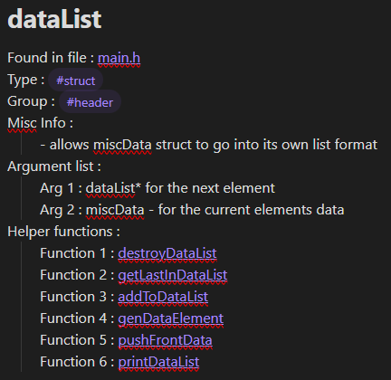

# Documentation Generator

A C program that I made to generate documentation from code comments <br>
Supports mutli-line and single-line comments for documentation generation <br>
I dont know if it has any vunerabilities or memory leaks, if it does, open an issue and I'll see if I can find it and fix it. <br>
I made this on Windows and the only debugging I found that was easy enough to use was gdb (I'm using VS Code not VS Community) <br>

## Example of program output
[exampleLog.txt](log.txt)
## How to use
At the moment you can run with as many filenames/filepaths as you want and it will spit out files in the current directory <br>
```
docGen.exe <filename> ...
```
However, I'd reccomend adding a output path with a premade folder, as the program will not generate files if a folder doesn't exist (I dont have it creating folders) <br>
```
docGen.exe -o ./folder/ <filename> ... 
```
<details open>
<summary>Programming details</summary>
<br>
The documentation comments are denoted by first, being a comment (who would have guessed!) and then having a tag initializer `@!` in the comment <br>
Immediatly following the initialiser you need a type specifier <br>
Currently there are 8 type specifiers <br>

```
Type              'T'
Name              'N'
Misc Info         'I'
Group             'G'
Function argument 'A'
Return type       'R'
Helper function   'F'
Date              'D'
```
For each section of comments you need a type tag <br>
a complete image overview of all the tags below <br>
 <br>

An example of a file comment is the following <br>
```
// @!T File
// @!N main.c
// @!I Some misc information about the file
// @!G Grouping for the file
// @!D 21/04/2025 (date)
```
Some of the tags only allow for one entry <br>
A list of single string tags are the following 
```
Type              'T'
Name              'N'
Group             'G'
Return type       'R'
Date              'D'
```
Alternitively the other three tag specifiers are lists of strings allowing for several lines for each documentation entry
```
Misc Info         'I'
Function argument 'A'
helper function   'F'
```
At the moment none of the tags have default values if left blank <br>
<br>
I've implemented .md file generation and here's a photo of the result from this repository's files <br>

 <br>
</details>
<br>

## Code modification and redistrabution

Anyone can download and use the documentation generator <br>
Feel free to modify the code. However, I'd like my name to stay on the help printout <br>
If you make a considerable change, feel free to add your name (it would be kinda funny to see a printout of a dozen different peoples names), I'd just like to keep my name on it somewhere visible <br>
